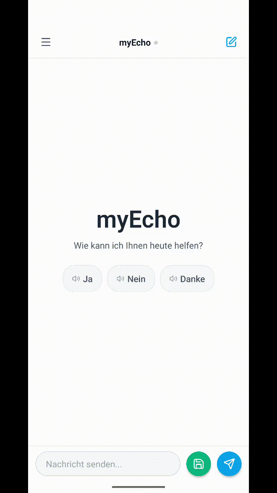
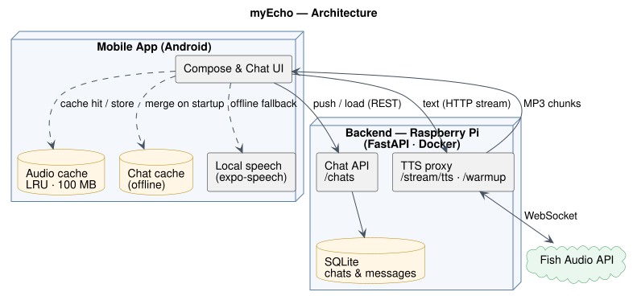

<div align="center">

🌐 [English](README.md) | **Deutsch**

# myEcho

## *„Denen eine Stimme geben, die ihre verloren haben."*

<br/>

**Assistive Kommunikations-App für Menschen mit Stimmstörungen.**

Tippe, was du sagen möchtest — myEcho spricht es mit einer natürlichen KI-Stimme aus.

<br/>


</div>

---

## Inhaltsverzeichnis

- [Über das Projekt](#über-das-projekt)
- [Demo](#demo)
- [So funktioniert es](#so-funktioniert-es)
- [Projektstruktur](#projektstruktur)
- [Mobile App](#mobile-app)
- [Backend](#backend)
- [Monitoring](#monitoring)
- [CI/CD](#cicd)
- [Status](#status)

---

## Über das Projekt

**myEcho wurde für Menschen entwickelt, die ihre eigene Stimme nicht mehr nutzen können.**

Sprechen kann anstrengend, schmerzhaft oder unmöglich sein — und bestehende Lösungen sind oft zu kompliziert. myEcho ist das Gegenteil: eine ruhige, einfache Oberfläche, in der du tippst, was du sagen möchtest, und die App es mit einer natürlichen Stimme ausspricht. Keine Hürden. Keine Komplexität.

---

## Demo

<div align="center">



</div>

---

## So funktioniert es

<div align="center">



</div>

> Diagramm-Quelle: [`docs/architecture.puml`](docs/architecture.puml) (PlantUML). Neu erzeugen mit `java -jar plantuml.jar -tsvg docs/architecture.puml`.

1. Der Nutzer öffnet das Eingabefeld → das Backend wärmt die Fish-Audio-Verbindung vor
2. Der Nutzer tippt und drückt auf Senden
3. Die App prüft den Audio-Cache auf dem Gerät → bei einem Treffer wird sofort aus der lokalen Datei abgespielt
4. Cache-Miss: Die App fordert das Audio per HTTP-Streaming vom selbst gehosteten Backend an
5. Das Backend leitet den Text an Fish Audio weiter und streamt MP3-Chunks in Echtzeit zurück
6. Die MP3 wird im Geräte-Cache gespeichert, sodass dieselbe Phrase beim nächsten Mal sofort abgespielt wird
7. Ist das Backend nicht erreichbar, wechselt die App automatisch auf lokale Sprachsynthese

Chats werden unabhängig vom Audio synchronisiert:

- Beim Start lädt die App die Chats vom Backend und **führt sie zusammen** mit der lokalen Kopie — nichts wird überschrieben, der bestehende Verlauf geht nie verloren und übersteht eine Neuinstallation
- Wenn sich ein Chat ändert, wird er lokal gespeichert und an das Backend gesendet; ist das Backend offline, wird die lokale Kopie genutzt und beim nächsten erreichbaren Start synchronisiert

---

## Projektstruktur

```
My-Echo/
├── backend/
│   ├── main.py                 FastAPI — TTS-Streaming + Warmup + Health + Chats
│   ├── db.py                   SQLite-Persistenz für Chats & Nachrichten
│   ├── test_main.py            pytest-Suite (TTS + Health)
│   ├── test_chats.py           pytest-Suite (Chat-Endpunkte)
│   ├── requirements.txt
│   ├── docker-compose.yml      Backend-Stack + persistentes Chat-DB-Volume
│   └── Dockerfile
├── mobile-app/
│   ├── app/                    expo-router Screens
│   ├── components/             Sidebar, ChatArea, Message
│   ├── context/                CloudStatusContext (Health-Check + grüner Punkt)
│   └── utils/                  storage, chatSync, tts, ttsCache, ttsLog, config, types, stats
├── monitoring/
│   ├── docker-compose.yml      Prometheus + Grafana Stack
│   ├── prometheus/             Scrape-Konfiguration
│   └── grafana/                Dashboard + Datasource-Provisioning
└── .github/workflows/
    ├── android-release.yml     Signierter APK/AAB-Build + GitHub Release
    ├── mobile-ci.yml           npm ci + Typecheck bei jedem mobile-app Push/PR
    ├── backend-deploy.yml      Docker-Image bauen + nach GHCR pushen
    └── backend-tests.yml       pytest + Coverage-Badge
```

---

## Mobile App

### Funktionen

- **Cloud-TTS** — Nachrichten werden über Fish Audio in einer natürlichen KI-Stimme gesprochen
- **HTTP-Streaming** — die Wiedergabe startet sofort, ohne auf das komplette Audio zu warten
- **Audio-Cache auf dem Gerät** — wiederholte Phrasen werden sofort aus einem lokalen LRU-Cache abgespielt (100 MB Limit, räumt auf 80 MB auf); Trefferquote und Größe sind im Statistik-Screen sichtbar
- **Pre-Warming** — das Backend bereitet die Fish-Audio-Verbindung vor, während der Nutzer tippt
- **Wiedergabe im Hintergrund** — die Sprache läuft weiter, wenn der Bildschirm gesperrt wird oder die App im Hintergrund ist, sodass lange Nachrichten ohne Unterbrechung zu Ende gesprochen werden
- **Automatischer Fallback** — wechselt auf lokale Sprachsynthese, wenn das Backend nicht verfügbar ist
- **Status-Anzeige** — ein grüner Punkt im Header zeigt, ob die Cloud-Verbindung aktiv ist
- **Chatverlauf in der Seitenleiste** — Chats erstellen, anheften, umbenennen und löschen
- **Täglicher Auto-Chat** — jeden Tag wird automatisch ein neuer Chat angelegt
- **Zwei Sende-Aktionen** — *Senden* speichert und spielt die Nachricht automatisch ab; *Speichern* legt sie still ab
- **Wiedergabe pro Nachricht** — jede Sprechblase hat einen Play/Pause-Button
- **Nachrichtentext kopieren** — lange auf eine Nachricht tippen, um den Text in die Zwischenablage zu kopieren
- **Bearbeiten im Vollbild** — auf den Stift an einer Nachricht tippen, um sie in einem fokussierten, ablenkungsfreien Modal zu bearbeiten
- **Nutzungsstatistik** — erfasst gesprochene Zeichen und TTS-Antwortzeiten
- **Chat-Sync mit dem Backend** — Chats und Nachrichten werden in der Backend-Datenbank gespeichert und beim Start mit der lokalen Kopie zusammengeführt, sodass der Verlauf eine Neuinstallation übersteht
- **Offline-Cache** — Chats werden als lokale JSON-Datei auf dem Gerät zwischengespeichert und genutzt, wenn das Backend nicht erreichbar ist

### Lokal starten

Benötigt Node 24 LTS (passend zu CI und Docker-Image).

```bash
cd mobile-app
cp .env.example .env   # EXPO_PUBLIC_BACKEND_URL auf die eigene Backend-IP setzen
npm install
npm start
```

---

## Backend

Ein schlanker FastAPI-Dienst, der Streaming-TTS-Anfragen an Fish Audio weiterleitet und den Chatverlauf in einer lokalen SQLite-Datenbank speichert. Selbst gehostet auf einem Raspberry Pi, erreichbar über WireGuard-VPN. Wird als Docker-Image über GHCR verteilt.

### Endpunkte

| Methode  | Pfad            | Beschreibung                                                   |
|----------|-----------------|----------------------------------------------------------------|
| `GET`    | `/stream/tts`   | Streamt MP3-Audio für `?text=...` per Chunked HTTP             |
| `GET`    | `/warmup`       | Wärmt die Fish-Audio-Verbindung vor, bevor der Nutzer sendet   |
| `GET`    | `/health`       | Liefert Provider-Status, Stimme/Modell und API-Guthaben        |
| `GET`    | `/chats`        | Liefert alle gespeicherten Chats                               |
| `PUT`    | `/chats/{id}`   | Erstellt oder aktualisiert einen Chat (Upsert)                 |
| `DELETE` | `/chats/{id}`   | Löscht einen Chat                                              |
| `GET`    | `/metrics`      | Prometheus-Metrik-Endpunkt                                     |

### Konfiguration

| Variable           | Standard         | Zweck                                                         |
|--------------------|------------------|---------------------------------------------------------------|
| `TTS_API_KEY`      | —                | Fish-Audio-API-Key                                            |
| `TTS_MODEL`        | `s2-pro`         | Modellname                                                    |
| `TTS_VOICE`        | —                | Stimme / Referenz-ID                                          |
| `TTS_LATENCY`      | `balanced`       | `normal`, `balanced` oder `low`                               |
| `TTS_CHUNK_LENGTH` | `50`             | Tokens bis zum ersten Audio-Chunk (niedriger = schnelleres TTFA) |
| `DB_PATH`          | `/data/chats.db` | Speicherort der SQLite-Chat-Datenbank                         |

### Deployment (Raspberry Pi über Portainer)

1. Portainer → **Stacks → Add stack → Web editor**
2. Inhalt von `backend/docker-compose.yml` einfügen
3. Die oben genannten Umgebungsvariablen hinzufügen
4. Deployen — der Container öffnet Port `4444` und speichert Chats im Volume `myecho-data` (eingehängt unter `/data`)

Updates: Push auf `main` → GitHub Actions baut ein neues Image → in Portainer **Pull and redeploy**. Das Volume `myecho-data` bleibt bei Updates erhalten, der Chatverlauf geht also nicht verloren.

---

## Monitoring

Prometheus + Grafana Dashboard, selbst gehostet auf dem Pi. Die Grafana-URL wird über `BACKEND_HOST` in `monitoring/.env` konfiguriert.

```bash
cp monitoring/.env.example monitoring/.env   # BACKEND_HOST auf die Pi-IP setzen
docker compose -f monitoring/docker-compose.yml up -d
```

Zeigt Request-Rate, Latenz (p50/p95/p99), Fehlerrate und Warmup-Trefferquote.
Der komplette Stack liegt in [`monitoring/`](monitoring/) — `monitoring/docker-compose.yml` wird genauso deployt wie das Backend; Grafana-Dashboard und Prometheus-Datasource werden automatisch eingerichtet.

---

## CI/CD

| Workflow | Auslöser | Ergebnis |
|---|---|---|
| `android-release.yml` | Push eines Tags `v*.*.*` (oder manueller Lauf) | Signierter APK/AAB am GitHub Release |
| `mobile-ci.yml` | Push & PR mit Änderungen in `mobile-app/` | `npm ci` + TypeScript-Typecheck |
| `backend-deploy.yml` | Push auf `backend/` in `main` | Docker-Image wird nach GHCR gepusht |
| `backend-tests.yml` | Jeder Push & PR | pytest-Lauf + Aktualisierung des Coverage-Badges |

```bash
# Mobile-Release
git tag v2.0.1 && git push origin v2.0.1

# Das Backend wird bei jedem Push auf backend/ automatisch deployt
```

---

## Status

Die App befindet sich in aktiver Entwicklung und ist für den persönlichen Gebrauch gebaut.

---
Dieses Projekt wird mit Hilfe von Claude und anderen KI-Tools entwickelt.
